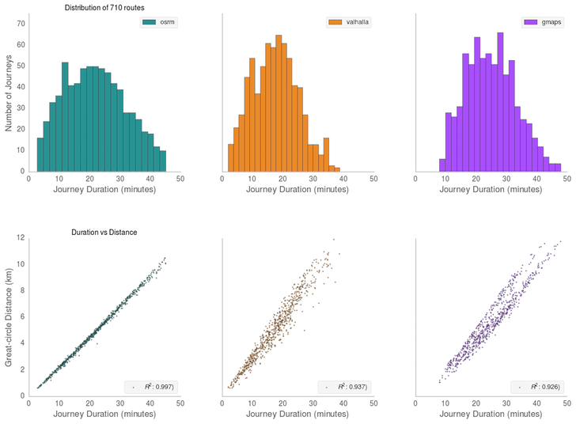
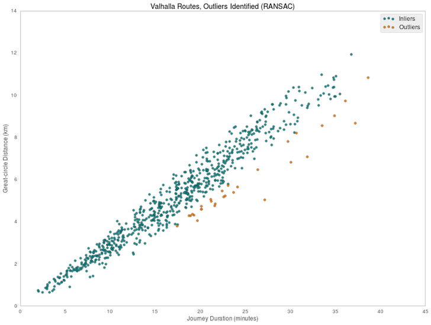
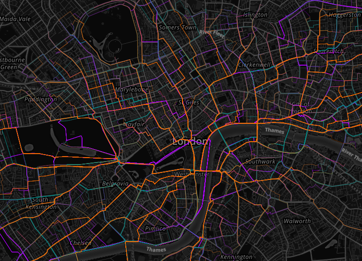

# Comparing The Cycle Route Characteristics of Three Routing Engines
Routers analysed: [OSRM](http://project-osrm.org), [Valhalla](https://mapzen.com/projects/valhalla/), [Google Maps Directions](https://developers.google.com/maps/documentation/directions/intro)

  

First, ensure you've installed all the packages from [requirements.txt](requirements.txt).  
`Basemap` can be pain to install, but a recent version of pip and `pip install basemap --allow-external basemap --allow-unverified basemap` should work.  

Once this is done, run `ipython notebook` from a shell, and you should see `OSRM_vs_Valhalla` in the list.
Some helper functions for the retrieval and processing of journeys can be found in [helpers.py](helpers.py)

# Outlier Identification using [RANSAC]()

# HTML Route visualisation using Leaflet
Can be found in the `html` directory. You may have to refresh the page in order to display the route toggle control, because I apparently still don't understand JS closures `¯\_(ツ)_/¯`  

# License
[MIT](license.txt)

